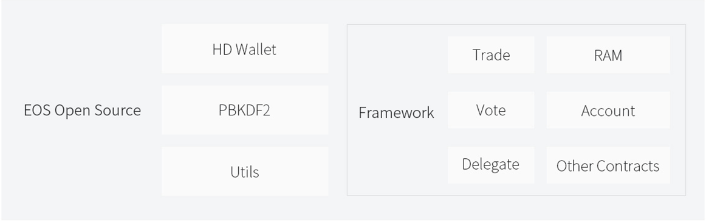

# eosio

The project was spun off from the bepal hardware wallet.

	[http://bepal.pro/](https://www.bepal.pro/)

Integrated [EOS](https://github.com/EOSIO/eos) contract.

	1. Conducting Trades

	2. Voting

	3. Delegating

	4. RAM trading

Follow up the EOS and support other contracts.